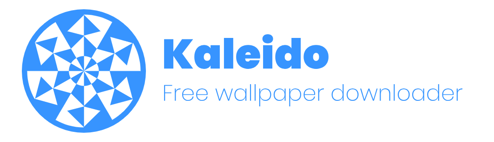
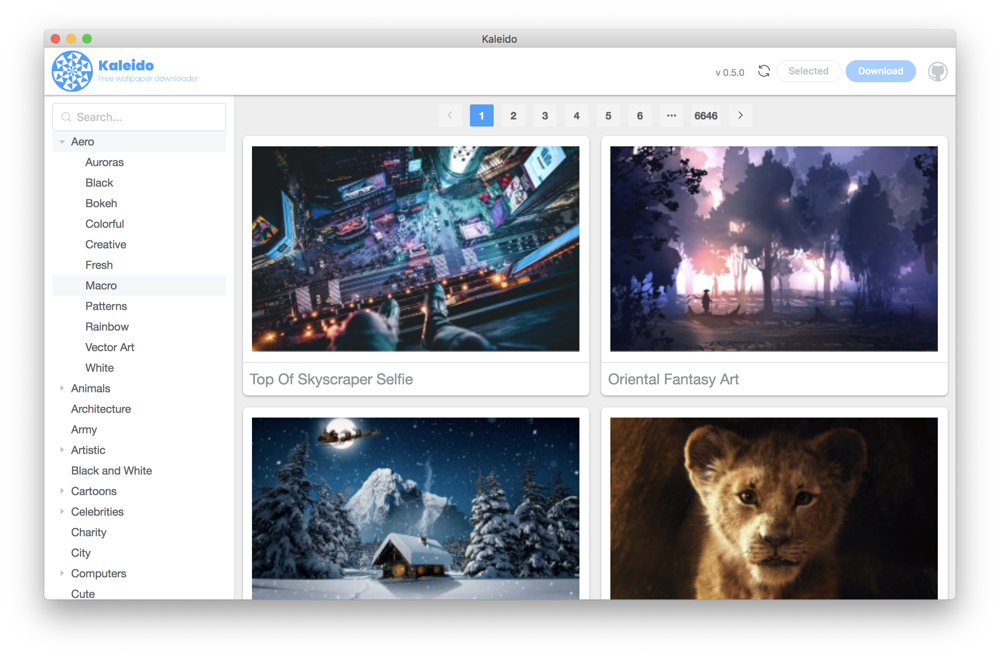
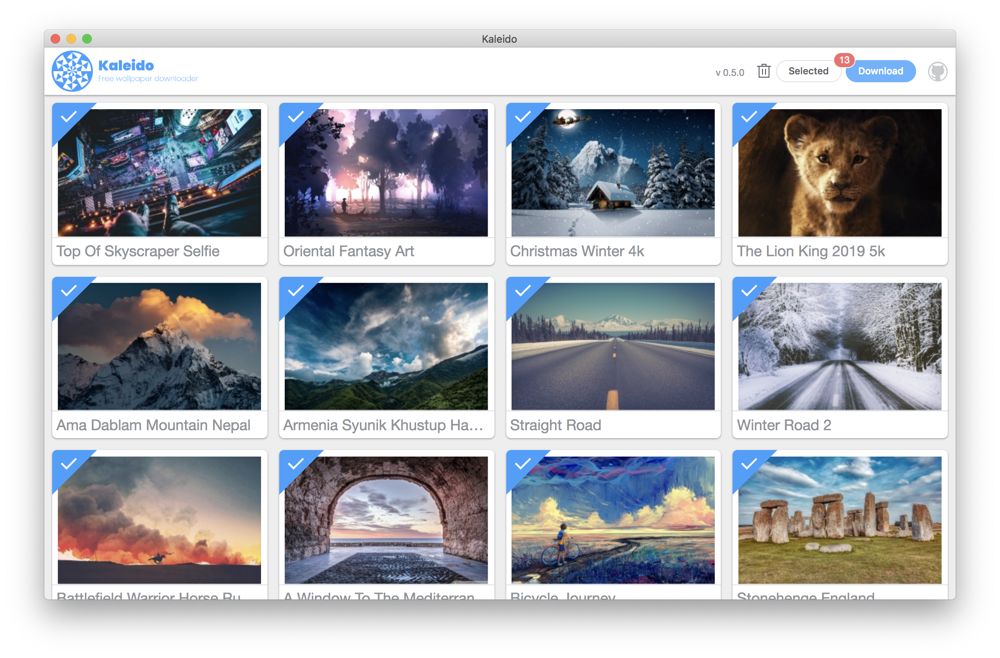
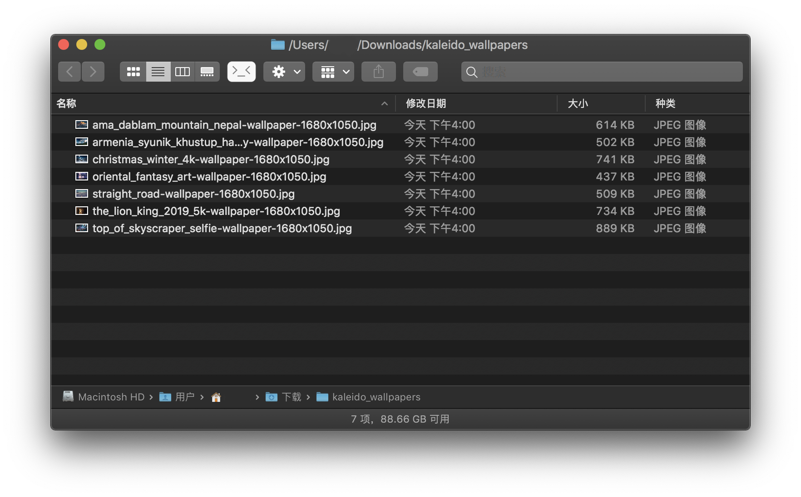
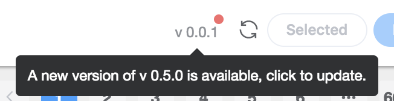

<h1 style="text-align:center">
  
</h1>

A free wallpaper downloader relates to [Wallpapers Wide](http://wallpaperswide.com/).

# Install
- [Kaleido for Mac](https://github.com/jrainlau/kaleido/releases/download/0.4.1/Kaleido-darwin-x64.zip)
- [Kaleido for Windows](https://github.com/jrainlau/kaleido/releases/download/0.4.1/Kaleido-win32-x64.zip)

# Features
Thanks to [Wallpapers Wide](http://wallpaperswide.com/), *Kaleido* provides thousands of classified free wallpapers for people to use.



By default, the resolution of downloaded wallpapers were depended on your screen's, but you can also choose a different resolution from the bottom of the side.

Once you pick up some wallpapers, you can download them immediately by clicking the top right button, or go to the "selected" page to manage them.




What's more, *Kaleido* would checks the latest version automatically after launching. It downloads the newest source and replaces the olds. Once relaunching, you will see a brand new *Kaleido*.



# Development
*Kaleido* was built in `Electron`, `VueJS` and `ElementUI`, developers could follow the steps below to participate into the development.

1. Clone the project
   ```
    git clone https://github.com/jrainlau/kaleido.git
   ```
2. Install dependencies
   ```
    npm install
   ```
3. Run in dev mode
   
   Open two terminal windows
   ```
    npm run serve
   ```
   ```
    npm run electron:dev
   ```
4. Run in build mode
   
   Open two terminal windows
   ```
    npm run build
   ```
   ```
    npm run electron:build
   ```
5. Package the app

   For MacOS
   ```
    npm run pack:mac
   ```
   For Windows
   ```
    npm run pack:win
   ```

# Disclaimer
1. *Kaleido* is for reference only and is strictly prohibited for commercial use.
2. Users must follw the disclaimer of [WallpapersWide.com](WallpapersWide.com):
   > WallpapersWide.com is a community supported website with the majority of the published content being uploaded by our user community or collected from a wide range of sources including free image repositories and websites. Although published content is believed to be authorized for sharing and personal use as desktop wallpaper either by the uploader / author or for being Public Domain / Free Culture licensed content, unless otherwise noted in the wallpaper description, all images on this website are copyrighted by their respective authors, therefore, if you wish to use these images for any other use you must get permission from their respective authors.

# Lisence
MIT